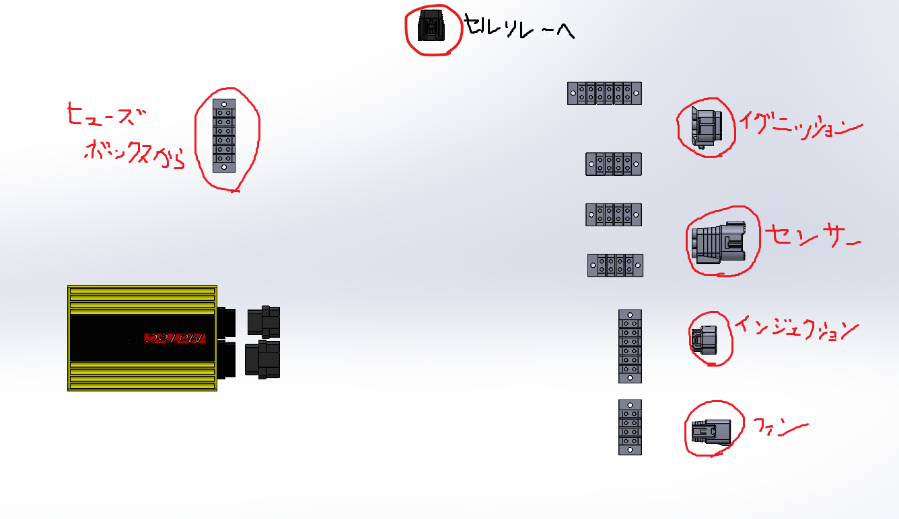

# MainWireHarnessの電装ASSYです。
NU24に作り変えるのをきっかけにNASからgithubでの運用に切り替えました。
NASだとファイルの履歴が残りませんが、githubだと履歴が残るからね。
ただCADはバイナリなので、リポジトリが巨大化していくので注意。

## リポジトリの解説
### ディレクトリの解説
│  MainWireHarness.SLDASM 
│  README.md
└─data: CAD以外のデータ(メモ書きなど)を入れましょう。
└─part : アセンブリで使うパーツはこのファイルに入っています。
&nbsp;&nbsp; &nbsp; &nbsp; &nbsp;├─connector : コネクターや端子台
&nbsp;&nbsp; &nbsp; &nbsp; &nbsp;└─part : その他電子部品

### ASSYの解説

## 注意点
* githubで運用しているので、1つの馬鹿でかいファイルをプッシュできません。  
>ただファイルが増えすぎて、フォルダが重いのは問題ありません。
* コミットやファイル名に関しては、以下のルールを守って運用しましょう。

## 本リポジトリにプッシュするときは以下を必ず守ること
### ファイル名
* ファイル名は英語にする。
>pushやcloneでファイル名が文字化けし、参照が外れる危険があるので。

* ファイル名はアッパーキャメルケースで書くこと
>Main wire harness → MainWireHarness
>mainWireHarness → MainWireHarness
>ちなみに私(天竺桂)の好みです。

* 基本的にはローマ字で命名しないで、英語で名前をつけてあげましょう

* 保存場所は考えて保存しましょう。

### コミットメッセージ
**Type: titleの構成を守る。**

#### Type
* どんなコミットなのかが分かるようにPrefixとしてコミットの種別を書きます。
* Semantic Commit Messageと同様の種別を使います。
  * chore
    * タスクファイルなどプロダクションに影響のない修正
  * docs
    * ドキュメントの更新
  * fix
    * 不具合の修正
  * feat
    * 見てわかる(CADの位置や形が変わる)追加や変更
  * refacter
    * 見てわからない(ファイル名の変更や参照箇所の変更など)改良
  * style
    * フォーマットなどのスタイルに関する修正(今回のリポジトリは使わないと思います。)
  * test
    * テストCADの追加や修正

#### Title
* 好きに書いてよいけど、あんまり長いメッセージはやめましょう。

#### コミットのルール
* 基本的にコミットは分けれるだけ、分けましょう。
* 目安はコミットメッセージを書く時にスラスラと書けるくらいです。
>つまりTypeが2つになるようなコミットはだめ、めっちゃタイトルが長くなるコミットは避けましょう。

